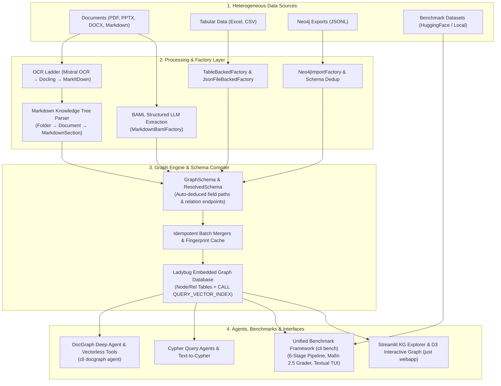

# GenAI Graph

Hybrid **Knowledge Graph**, **Document Graph**, and **GraphRAG** framework built on top of [genai-tk](https://github.com/tclatos/genai-tk).

GenAI Graph transforms unstructured document collections (PDF, PPTX, DOCX, Markdown), structured tables (Excel, CSV), and Neo4j exports into unified, queryable [Ladybug](https://github.com/LadybugDB/ladybug) graph databases. It provides autonomous document-walking agents, multi-dataset benchmark evaluation pipelines (`cli bench`), and interactive Streamlit/TUI visualization interfaces.

---

## Architecture Overview



---

## Core Pillars & Capabilities

### 📄 1. Document Graph & Markdown Knowledge Tree
Hierarchical document representation designed for deterministic, provenance-backed agent navigation:
- **Folder → Document → MarkdownSection** schema tracking exact line numbers, token budgets, and parent-child hierarchy.
- **Multi-strategy OCR ladder**: Mistral OCR (high-fidelity tables & equations) → Docling → MarkItDown fallback.
- **Vectorless Agentic RAG**: Tools that walk headings, search section titles, and fetch contiguous markdown ranges without vector chunk fragmentation.
- **Autonomous DocGraph Agent**: Pre-configured deep planning agent with specialized runtime skills (`cli docgraph agent`).
- See: `cli docgraph`, [docs/document-graph.md](docs/document-graph.md)

### 📊 2. Unified Benchmark Framework (`cli bench`)
Multi-dataset evaluation suite powering empirical AI evaluations (such as **FinanceBench**, **OfficeQA**, and **MMLongBench-Doc**):
- **6-Stage Pipeline**: Dataset Fetch → OCR / Markdownize → Hierarchical Graph Ingestion → Autonomous Agent Execution → LLM-as-Judge Evaluation → Summary Metric Aggregation.
- **Dynamic Adapter Pattern**: Subclass `BaseBenchmarkAdapter` to encapsulate domain dataset loaders, document fetchers, and judge rubrics.
- **Mafin 2.5 Evaluation Rules**: Numeric equivalence normalization (currency, scale, percentages, rounding), correctness tiers (`CORRECT`, `PARTIAL`, `INCORRECT`), and failure taxonomy (`missing_ocr`, `calculation`, `retrieval`, `halted`).
- **Interactive Textual TUI**: Live trajectory replay, token breakdowns, and verdict inspection with `cli bench questions -t --trajectory`.
- See: `cli bench`, [docs/benchmark_framework.md](docs/benchmark_framework.md), [docs/benchmarks_financebench_officeqa.md](docs/benchmarks_financebench_officeqa.md)

### 🕸️ 3. Knowledge Graph Engine & Schemas
Declarative graph modeling with Pydantic v2 and Ladybug:
- **Declarative Modeling**: Define plain Pydantic models; `GraphSchema` automatically deduces field paths, relationship endpoints, and primary keys.
- **Ladybug Backend**: Fast, embedded Kùzu fork with full Cypher compatibility, vector indexes (`CALL QUERY_VECTOR_INDEX`), and zero external database overhead.
- **Composite Factories**: Merge structured tabular data, JSON files, Neo4j dumps, and LLM extractions into a single graph with deduplicated node labels.
- **Parquet Caching**: Fingerprint-based caching skips unchanged sources during multi-step ETL workflows.
- See: `cli kg`, [docs/graph-definition-guide.md](docs/graph-definition-guide.md), [docs/schema-compilation.md](docs/schema-compilation.md)

### 🧩 4. 4-Tier Skills System
Progressive disclosure of domain knowledge for AI coding agents and runtime models:
- **`skills/runtime/`**: User capabilities (e.g. `kg-query`, `kg-docgraph-agent`, `kg-document-graph`, `kg-explorer`).
- **`skills/development/`**: Construction & evaluation recipes (e.g. `benchmark-framework`, `kg-cli`, `kg-schema`, `kg-factories`, `kg-ingest`, `kg-workflows`, `kg-neo4j-import`, `kg-export`).
- **`skills/governance/`**: Schema health, maintenance, and repository mapping (`kg-repo-map`, `kg-schema-maintenance`).
- **`skills/vendor/`**: Imported packages (`atos-slidev`).
- See: `cli skills`, [skills/README.md](skills/README.md), [docs/SKILLS.md](docs/SKILLS.md)

---

## Quick Start

### Recommended: Scaffold from Scratch

The preferred way to use `genai-graph` is to start from a clean project directory using `uv` and `genai-tk` scaffolding (see [genai-tk](https://github.com/tclatos/genai-tk)):

```bash
# 1. Create project directory and initialize with uv
mkdir my-graph-app && cd my-graph-app
uv init

# 2. Add genai-tk and genai-graph dependencies
uv add "genai-tk @ git+https://github.com/tclatos/genai-tk@main"
uv add "genai_graph @ git+https://github.com/tclatos/genai-graph@main"

# 3. Bootstrap configuration, merged skills, benchmark tools, and starter files
uv run cli init --name "My Knowledge Graph App" --with-graph

# Optional: for active development with a local editable checkout of genai-graph:
# uv run cli init --name "My Benchmark Suite" --with-graph --graph-path /path/to/genai-graph

# 4. Sync dependencies and run
uv sync
just run                           # launch interactive agent chat
uv run cli bench list              # list benchmark profiles
uv run cli docgraph --help         # inspect Document Graph commands
```

### Library Development (Clone & Contribute)

If you are contributing directly to `genai-graph`:

```bash
git clone https://github.com/tclatos/genai-graph.git && cd genai-graph
uv sync

# Verify CLI commands
uv run cli --help
```

---

## CLI Reference

### 1. Document Graph (`cli docgraph`)

```bash
# Build a Document Graph from raw documents (PDF, DOCX, PPTX, Markdown)
uv run cli docgraph build ./docs --db ./data/kg/tree.db

# Inspect documents and Table of Contents (TOC)
uv run cli docgraph list --db ./data/kg/tree.db
uv run cli docgraph toc <doc-name-or-hash> --db ./data/kg/tree.db

# Full-text search across section headings and content
uv run cli docgraph search "operating expenses" --db ./data/kg/tree.db

# Run the autonomous Document Graph agent interactively
uv run cli docgraph agent --chat --db ./data/kg/tree.db
uv run cli docgraph agent "What were the total revenues in Q3?" --db ./data/kg/tree.db
```

### 2. Benchmark Framework (`cli bench`)

```bash
# List configured benchmark profiles
uv run cli bench list

# Execute full evaluation pipeline
uv run cli bench run -p mistral_glm
uv run cli bench run -p mistral_glm -q question_001,question_002  # run specific questions
uv run cli bench run -p mistral_glm --dry-run                    # preview pipeline steps
uv run cli bench run -p mistral_glm --no-grade                   # run agent without grading

# Re-grade existing runs with LLM-as-judge
uv run cli bench grade -p mistral_glm --force

# Metric summary report
uv run cli bench report -p mistral_glm

# Inspect questions and trajectories in interactive Textual TUI
uv run cli bench questions -p mistral_glm -t --trajectory
```

### 3. Knowledge Graph Construction (`cli kg`)

```bash
# Create / rebuild a knowledge graph from a workflow profile
uv run cli kg create my_graph
uv run cli kg create my_graph --dry-run
uv run cli kg create my_graph --force

# Inspect graph schema and statistics
uv run cli kg schema
uv run cli kg info
uv run cli kg cypher "MATCH (n) RETURN labels(n), count(*)"
uv run cli kg query "Which companies have the most projects?"

# Launch Streamlit KG Explorer UI (Cypher console, D3 graph visualization)
just webapp
```

### 4. Neo4j Import (`cli neo4j`)

```bash
# Analyze schema and export structure from Neo4j JSONL export
uv run cli neo4j analyze export.jsonl -o schema.cypher

# Create a small subset for rapid testing
uv run cli neo4j subset export.jsonl subset.jsonl --max-nodes 50 --max-rels 50

# Import into Ladybug database
uv run cli neo4j import export.jsonl --db ./data/kg/imported.db --force

# Query imported database
uv run cli neo4j query "MATCH (n:Person)-[:WORKS_AT]->(c:Company) RETURN n.name, c.name" --db ./data/kg/imported.db
```

---

## Defining a Knowledge Graph in Python

### 1. Declare Pydantic Domain Models

```python
from pydantic import BaseModel, Field


class Company(BaseModel):
    name: str
    sector: str | None = None


class Person(BaseModel):
    name: str
    role: str | None = None


class Project(BaseModel):
    title: str
    client: Company  # Relationship endpoint
    team: list[Person] = Field(default_factory=list)  # Relationship collection
```

### 2. Compile Schema and Ingest

```python
from genai_graph.kg.ingest import create_graph, restart_database
from genai_graph.kg.schema import GraphNode, GraphRelation, GraphSchema

# Define nodes with identity keys
company_node = GraphNode(node_class=Company, name_from="name", key_from="name")
person_node = GraphNode(node_class=Person, name_from="name", key_from="name")
project_node = GraphNode(node_class=Project, name_from="title", key_from="title")

# Define schema and relationships
schema = GraphSchema(
    root_model_class=Project,
    nodes=[project_node, company_node, person_node],
    relations=[
        GraphRelation(from_node=project_node, to_node=company_node, name="FOR_CLIENT"),
        GraphRelation(from_node=project_node, to_node=person_node, name="HAS_MEMBER"),
    ],
)

# Ingest data into Ladybug
backend = restart_database()
project_data = Project(
    title="Cloud Transformation",
    client=Company(name="Global Logistics Corp", sector="Supply Chain"),
    team=[Person(name="Alice", role="Tech Lead"), Person(name="Bob", role="Architect")],
)
create_graph(backend, project_data, schema)

# Query via Cypher
df = backend.execute_get_as_df("MATCH (p:Project)-[:FOR_CLIENT]->(c:Company) RETURN p.title, c.name")
print(df)
```

---

## Authoring a Benchmark Adapter

Implement `BaseBenchmarkAdapter` from `genai_graph.bench.adapters.base`:

```python
from pathlib import Path
from genai_graph.bench.adapters.base import (
    BaseBenchmarkAdapter,
    download_hf_file,
    load_hf_dataset_to_pandas,
)
from genai_graph.bench.models import BenchQuestion


class MyBenchmarkAdapter(BaseBenchmarkAdapter):
    """Custom benchmark adapter for evaluating contract understanding."""

    DATASET_REPO = "my_org/contract_qa"

    def load_dataset(self, split: str | None = "test", cache_dir: Path | None = None) -> list[BenchQuestion]:
        df = load_hf_dataset_to_pandas(self.DATASET_REPO, split=split or "test", cache_dir=cache_dir)
        return [
            BenchQuestion(
                id=str(row["id"]),
                doc_name=str(row["contract_name"]),
                doc_names=[str(row["contract_name"])],
                question=str(row["question"]),
                gold_answer=str(row["gold_answer"]),
                evidence=[str(row.get("clause_text", ""))],
                metadata={"category": row.get("category", "")},
            )
            for _, row in df.iterrows()
        ]

    def fetch_document(self, doc_name: str, output_dir: Path) -> Path:
        dest_path = output_dir / f"{doc_name}.pdf"
        if dest_path.exists():
            return dest_path
        return download_hf_file(
            repo_id=self.DATASET_REPO,
            filename=f"pdfs/{doc_name}.pdf",
            repo_type="dataset",
            dest_path=dest_path,
        )

    def get_judge_rubric(self) -> str:
        return (
            "You are an expert legal evaluator assessing answers against ground truth.\n"
            "Score correctness, semantic accuracy, and groundedness in contract clauses."
        )
```

Configure `config/bench.yaml`:
```yaml
default_profile: standard
adapter: my_package.adapter.MyBenchmarkAdapter

bench_profiles:
  standard:
    llms:
      agent: default
      judge: default
    build:
      skip_ocr: false
      structure_strategy: auto
      summaries: true
      workers: 4
    files:
      pathspecs: ["*"]
    agent:
      profile: default
      concurrency: 10
    judge:
      concurrency: 10
```

---

## Documentation Index

| Documentation | Description |
|---|---|
| [docs/graph-definition-guide.md](docs/graph-definition-guide.md) | **5-Minute Quick Start**: Models → `GraphNode` → Schema → Ingestion → Query |
| [docs/document-graph.md](docs/document-graph.md) | Comprehensive Document Graph guide: Markdown Knowledge Tree, OCR, and DocGraph agent |
| [docs/benchmark_framework.md](docs/benchmark_framework.md) | Complete multi-dataset benchmark framework specification (`genai_graph.bench`) |
| [docs/benchmarks_financebench_officeqa.md](docs/benchmarks_financebench_officeqa.md) | Empirical evaluation and adapter implementations for FinanceBench and OfficeQA |
| [docs/graph-authoring-patterns.md](docs/graph-authoring-patterns.md) | Pattern catalog: JSON, tables, Neo4j, documents, BAML inline extraction, similarity |
| [docs/schema-compilation.md](docs/schema-compilation.md) | Schema compilation internals: field-path deduction, primary key rules, exclusions |
| [docs/graph_construction.md](docs/graph_construction.md) | Factory architecture, canonical types, schema merging, and CLI reference |
| [docs/workflows.md](docs/workflows.md) | Workflow DSL for KG pipelines; Prefect task orchestration |
| [docs/baml_extraction_guide.md](docs/baml_extraction_guide.md) | Type-safe structured LLM extraction with BAML integration |
| [docs/kg_explorer.md](docs/kg_explorer.md) | Streamlit KG Explorer, Cypher console, and D3 interactive visualization |
| [Agents.md](Agents.md) | Development guidelines and architectural invariants for coding agents |
| [Agents_Skills.md](Agents_Skills.md) | Step-by-step procedure runbooks for codebase maintenance |
| [skills/README.md](skills/README.md) | 4-Tier skills catalog and agent loading instructions |

---

## Interactive Notebooks

| Notebook | Description |
|---|---|
| [notebooks/01_define_graph_from_scratch.ipynb](notebooks/01_define_graph_from_scratch.ipynb) | End-to-end tutorial: defining Pydantic models, schema compilation, ingestion, Cypher querying, and D3 visualization. |
| [notebooks/cypher_examples.ipynb](notebooks/cypher_examples.ipynb) | Cypher patterns: basic, traversal, aggregation, filtering |
| [notebooks/document_graph_demo.ipynb](notebooks/document_graph_demo.ipynb) | Document Graph ingestion (`Folder`/`Document`/`MarkdownSection`) from a markdown directory |
| [notebooks/cypher_query_development.ipynb](notebooks/cypher_query_development.ipynb) | Interactive Cypher development helper |

---

## Development & Testing

```bash
just install-dev   # install with development dependencies
just fmt           # format with ruff
just lint          # lint with ruff
just test          # run all tests (unit + integration)
just check         # fmt + lint + test
```
```
