# GenAI Graph Documentation Index

Welcome to the **GenAI Graph** documentation. This index organizes guides, architecture specifications, and references by learning path and technical domain.

---

## 🗺️ Learning Paths & Quick Navigation

```mermaid
flowchart LR
    A["New User / 5-Min Tour"] --> B["1. Knowledge Graph Foundation"]
    A --> C["2. Hierarchical Document Graph"]
    B --> D["3. Ingestion & Workflows"]
    C --> D
    D --> E["4. Benchmarks & Evaluation"]
    D --> F["5. Interactive Exploration"]
```

---

## 1. Getting Started & Knowledge Graph Fundamentals

Learn how to define, compile, ingest, and query graph schemas using Pydantic v2 and the embedded [Ladybug](https://github.com/LadybugDB/ladybug) engine.

| Guide | Description | Key Topics |
|---|---|---|
| [graph-definition-guide.md](graph-definition-guide.md) | **5-Minute Graph Guide** | Define nodes & relations from Pydantic models, build schema, run in-memory, query Cypher |
| [graph-authoring-patterns.md](graph-authoring-patterns.md) | **Authoring Patterns** | JSON files, tabular databases, Neo4j imports, cross-factory unification |
| [schema-compilation.md](schema-compilation.md) | **Schema Compiler Deep-Dive** | Field-path deduction, primary key inference, metadata exclusions |
| [graph_construction.md](graph_construction.md) | **Construction Pipeline** | Multi-source merging, canonical types, batch parquet imports |
| [primary_key_implementation.md](primary_key_implementation.md) | **Deduplication & Primary Keys** | Deterministic node hashing, MERGE mechanics, migration |

---

## 2. Document Graph & Agentic RAG (Structure-First)

Transform unstructured documents (PDF, DOCX, PPTX, Markdown) into deterministic outline trees for vectorless agentic navigation.

| Guide | Description | Key Topics |
|---|---|---|
| [document-graph.md](document-graph.md) | **Document Graph Architecture** | `Folder` → `Document` → `MarkdownSection` → `SectionChunk` schema, hybrid search |
| [document-decomposition-guide.md](document-decomposition-guide.md) | **Decomposition Guide** | Multi-tier heading parser, token counting, table/image preservation |
| [docgraph-agent.md](docgraph-agent.md) | **Autonomous DocGraph Agent** | Deep planning agent, outline inspection, section fetching, `cli docgraph agent` |
| [access-control-security-trimming.md](access-control-security-trimming.md) | **Security Trimming (ACL)** | Document-level authorization, principal propagation, early-binding retrieval filters |

---

## 3. Ingestion, Extraction & Workflow Orchestration

Automate multi-step ETL pipelines combining OCR, LLM extraction, and graph loading.

| Guide | Description | Key Topics |
|---|---|---|
| [workflows.md](workflows.md) | **KG Workflows & CLI Reference** | Composable YAML workflows, profile overrides, `cli kg`, `cli docgraph` commands |
| [prefect_dag_pipeline.md](prefect_dag_pipeline.md) | **Prefect DAG Pipeline** | Prefect flow integration, task dependencies, concurrency |
| [baml_extraction_guide.md](baml_extraction_guide.md) | **BAML Extraction** | High-throughput structured LLM extraction into graph entities |
| [cache_management.md](cache_management.md) | **Cache Management** | Fingerprint invalidation, intermediate parquet reuse |

---

## 4. Benchmarking & Empirical Evaluation

Evaluate agent accuracy, retrieval fidelity, and cost on standard long-document benchmarks.

| Guide | Description | Key Topics |
|---|---|---|
| [benchmark_framework.md](benchmark_framework.md) | **Unified Benchmark Framework** | 6-stage pipeline (Dataset → OCR → Graph → Agent → Judge → Metrics), `cli bench` |
| [benchmarks_financebench_officeqa.md](benchmarks_financebench_officeqa.md) | **Benchmark Evaluation Studies** | Empirical performance and failure analysis on FinanceBench & OfficeQA Pro |
| [slides-benchmark.md](slides-benchmark.md) | **Benchmark Slide Deck** | Executive and technical Slidev presentation deck |
| [studies/README.md](studies/README.md) | **Research & Studies Directory** | Framework surveys (DocAtlas, MDocAgent, VLD-RAG), codebase audits |

---

## 5. UI, Visualization & Skills

Explore graphs interactively and empower autonomous AI coding agents.

| Guide | Description | Key Topics |
|---|---|---|
| [kg_explorer.md](kg_explorer.md) | **Streamlit KG Explorer** | Interactive graph traversal, D3 schema diagrams, text-to-Cypher interface |
| [SKILLS.md](SKILLS.md) | **Skills Guide** | 4-tier skills architecture (`runtime`, `development`, `governance`, `vendor`) |
| [design/README.md](design/README.md) | **Design Specifications** | Active proposals including LightRAG corpus-scale entity layer |

---

## 🚀 Hands-On Notebooks

Try the interactive Jupyter tutorials under `notebooks/`:
- [01_define_graph_from_scratch.ipynb](../notebooks/01_define_graph_from_scratch.ipynb) — Build an in-memory knowledge graph from Pydantic models in 5 minutes.
- [02_document_graph_full_pipeline.ipynb](../notebooks/02_document_graph_full_pipeline.ipynb) — End-to-end OCR, Markdown Knowledge Tree parsing, and agent navigation.
- [03_access_control_security_trimming.ipynb](../notebooks/03_access_control_security_trimming.ipynb) — Enterprise access control and security trimming.
- [cypher_examples.ipynb](../notebooks/cypher_examples.ipynb) — Common Cypher query idioms and vector similarity search.
- See: [notebooks/README.md](../notebooks/README.md) for full execution instructions.
