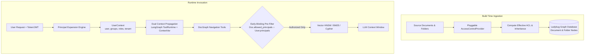
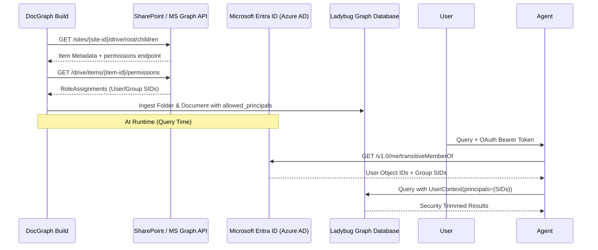

# Document Graph Access Control & Security Trimming Architecture

> Enterprise-grade document-level authorization, early-binding retrieval pre-filtering, and pluggable identity provider integration for Hierarchical Document Graphs and Agentic RAG.

---

## 1. Executive Summary & Global Approach

In an Enterprise Knowledge Graph (EKG) and Agentic RAG system, users must only retrieve information they are authorized to see. The LLM must **never process unauthorized context in its context window**.

### Why Security Trimming over Authorization Graph Edges?

A naive graph authorization model stores permissions as graph edges:
```text
(User:alice)-[:CAN_READ]->(Document:annual_report)
(Group:finance)-[:CAN_READ]->(Document:budget_2026)
```

In an enterprise environment (e.g. Microsoft 365, SharePoint, Google Workspace, AWS S3), this naive model fails due to:
1. **Edge Explosion:** Millions of documents $\times$ tens of thousands of users and groups results in hundreds of millions of dynamic edges.
2. **High-Frequency Synchronization Bottlenecks:** Group membership changes, role assignments, and permission inheritance breaks occur continuously. Recomputing graph edges on every change causes write lock contention and sync lag.
3. **Index Disconnect:** Vector similarity indices (HNSW) and Full-Text Search (BM25) do not natively traverse dynamic graph relationships during candidate selection.

### The Security Trimming Model

**Security Trimming** tags each `Folder` and `Document` node with an `allowed_principals` list:
$$\text{allowed\_principals} = [\text{"group:03d8e370"}, \text{"group:9e2f7b44"}, \text{"user:5d8a7ca1"}, \text{"public"}]$$

At retrieval time, the system resolves the authenticated caller's identity into an expanded set of effective security identifiers (SIDs):
$$\text{User.principals} = \{\text{"user:alice"}, \text{"group:finance"}, \text{"role:viewer"}, \text{"public"}\}$$

Access is granted if and only if:
$$\text{Document.allowed\_principals} \cap \text{User.principals} \neq \emptyset \quad \lor \quad \text{User.is\_admin} = \text{True}$$



---

## 2. Early-Binding (Pre-filtering) vs. Late-Binding (Post-filtering)

| Dimension | Early-Binding (Pre-filtering) — **Implemented** | Late-Binding (Post-filtering) — **Rejected** |
|---|---|---|
| **Enforcement Point** | Query engine / Index level | In-memory application code after retrieval |
| **Top-$K$ Retrieval** | Returns full top-$K$ authorized items | Can return $0$ items if top hits are forbidden (Top-$K$ starvation) |
| **Data in Memory** | Unauthorized text is never loaded into memory | Unauthorized chunks loaded into memory buffers |
| **Side-Channel Timing** | Constant-time evaluation across candidates | Response time leaks presence/size of restricted documents |
| **Observability Safety** | Traces and logs contain only authorized data | LangSmith/OTEL traces risk logging restricted chunks |

---

## 3. Configuration & Usage

Access control is configured declaratively in the DocGraph profile YAML (`config/docgraph.yaml`).

### YAML Configuration

```yaml
docgraph:
  paths:
    sources_dir: "data/source_docs"
    markdown_dir: "data/markdown_multi"
    kg_db: "data/kg/enterprise.db"
  
  access_control:
    # Provider: 'default' (public), 'yaml' (file rules), or qualified Python class
    provider: "genai_graph.kg.access.yaml_provider.YamlAccessControlProvider"
    
    # Inheritance mode: 'intersection' (Folder ∩ Doc), 'override', or 'union'
    inheritance_mode: "intersection"
    
    # Trimming feedback: 'aggregate_notice', 'zero_knowledge', or 'placeholder'
    trimming_feedback: "aggregate_notice"
    
    # Provider-specific options
    options:
      yaml_path: "config/access_rules.yaml"
      default: ["public"]
```

### Access Rules Definition (`config/access_rules.yaml`)

```yaml
default: ["public"]

rules:
  # Executive board directory: restricted override
  - path: "executive/**"
    allowed_principals: ["group:board_members", "role:executive"]
    inheritance: "override"

  # HR salary and confidential folder
  - path: "hr/confidential/**"
    allowed_principals: ["group:hr_leadership", "user:5d8a7ca1"]
    inheritance: "intersection"

  # Finance quarterly reports
  - path: "finance/q*/*.pdf"
    allowed_principals: ["group:finance_dept", "role:cfo"]
    inheritance: "inherit"

  # Public documentation
  - path: "public/**"
    allowed_principals: ["public"]
    inheritance: "override"
```

### CLI Ingestion and Querying

```bash
# Ingest document graph with access control
uv run cli docgraph build --config config/docgraph.yaml

# Query as an anonymous/public user
uv run cli docgraph list

# Query with specific user principals
uv run cli docgraph list --user alice --principals "group:finance_dept,role:cfo"

# Run Agent session with authenticated context
uv run cli agents run docgraph-expert --user alice --principals "group:hr_leadership" -- "Summarize Q3 payroll"
```

---

## 4. Implementation Details

### 4.1 Data Models (`genai_graph.kg.nodes.document`)

Both `Folder` and `Document` node models store `allowed_principals: list[str]`:

```python
class Folder(BaseModel):
    folder_id: str
    parent_folder_id: str | None = None
    uri: str
    kind: Literal["directory", "zip", "file", "sharepoint"] = "directory"
    name: str
    allowed_principals: list[str] = Field(default_factory=lambda: ["public"])

class Document(BaseModel):
    content_hash: str  # Primary Key (xxHash XXH3-64)
    markdown_hash: str | None = None
    filename: str
    folder_id: str | None = None
    relative_path: str | None = None
    allowed_principals: list[str] = Field(default_factory=lambda: ["public"])
```

### 4.2 Pluggable Provider Interface (`genai_graph.kg.access.base`)

```python
class BaseAccessControlProvider(ABC):
    @abstractmethod
    async def get_document_acl(
        self,
        file_path: Path,
        relative_path: str,
        folder_chain: list[str] | None = None,
    ) -> AccessControlResult:
        """Asynchronously determine ACL for a document."""

    @abstractmethod
    async def get_folder_acl(
        self,
        folder_path: Path,
        uri: str,
        parent_uri: str | None = None,
    ) -> AccessControlResult:
        """Asynchronously determine ACL for a folder."""
```

### 4.3 Dual Runtime Context Propagation (`genai_graph.kg.access.context`)

To support both **LangGraph agents** (via typed `ToolRuntime[UserContext]`) and **DeerFlow / CLI / Python scripts** (via `contextvars`), we implement a dual-resolution engine:

```python
CURRENT_USER_CONTEXT: ContextVar[UserContext | None] = ContextVar("current_user_context", default=None)

def get_active_user_context(runtime: Any = None) -> UserContext:
    if runtime is not None:
        if isinstance(runtime, UserContext):
            return runtime
        if hasattr(runtime, "context") and isinstance(runtime.context, UserContext):
            return runtime.context
    ctx = CURRENT_USER_CONTEXT.get()
    return ctx if ctx is not None else UserContext()
```

### 4.4 Tool-Level Security Trimming (`genai_graph.kg.query.document_graph_tools`)

Every DocGraph tool enforces security trimming:

1. **`list_documents`**: Pre-filters rows matching `user_context.has_access(row.allowed_principals)`. If configured with `aggregate_notice`, appends `[Note: N document(s) omitted due to access permissions]`.
2. **`get_folder_toc`**: Hides unauthorized folders and documents from the YAML hierarchy.
3. **`get_document_toc`**: Verifies document permissions; returns `Access Denied: You do not have permission to view document <id>` if unauthorized.
4. **`get_section_content`**: Joins `MarkdownSection.markdown_hash` to authorized documents. Unauthorized section requests return explicit `Access Denied` feedback.
5. **`search_sections`**: Pre-resolves `authorized_markdown_hashes` and scopes hybrid (vector + BM25) search before scoring.
6. **`query_image`**: Joins `Image.markdown_hash` to parent document ACL before sending image payloads to VLMs.

---

## 5. Extending to SharePoint & Enterprise Connectors

### 5.1 SharePoint / Microsoft 365 Graph Provider Architecture

To connect to SharePoint sites via Microsoft Graph SDK or `office365-rest-python-client`:



### 5.2 Implementation Blueprint: `SharePointAccessControlProvider`

```python
class SharePointAccessControlProvider(BaseAccessControlProvider):
    """Microsoft Graph SDK provider for SharePoint Online document libraries."""

    def __init__(self, client_id: str, client_secret: str, tenant_id: str, **kwargs):
        super().__init__(**kwargs)
        self.client = GraphServiceClient(
            credentials=ClientSecretCredential(tenant_id, client_id, client_secret)
        )

    async def get_document_acl(self, file_path: Path, relative_path: str, folder_chain=None) -> AccessControlResult:
        # Retrieve drive item permissions from Microsoft Graph
        drive_item = await self.client.drives.by_drive_id(...).items.by_drive_item_id(...).get()
        permissions = await self.client.drives.by_drive_id(...).items.by_drive_item_id(...).permissions.get()
        
        principals = []
        for perm in permissions.value:
            if perm.granted_to_v2:
                # User, Group, or Site Role
                if perm.granted_to_v2.user:
                    principals.append(f"user:{perm.granted_to_v2.user.id}")
                if perm.granted_to_v2.group:
                    principals.append(f"group:{perm.granted_to_v2.group.id}")
            if perm.link and perm.link.type == "anonymous":
                principals.append("public")

        return AccessControlResult(
            allowed_principals=principals,
            inheritance="override" if drive_item.has_unique_role_assignments else "inherit",
        )
```

### 5.3 Incremental Sync with Delta Queries
- Use Microsoft Graph **Delta Queries** (`/drives/{drive-id}/root/delta`) to receive changes, deletes, and permission updates incrementally without full corpus re-scans.
- When an ACL changes on a folder with inherited permissions, update `Folder.allowed_principals` and child documents in a single transactional batch.

---

## 6. Critical Security Points of Attention & Vulnerability Analysis

### 1. Orphan Node Query Bypass (Section, Chunk & Image Leakage)
- **Vulnerability:** `MarkdownSection`, `SectionChunk`, and `Image` nodes are separate entities from `Document`. Direct Cypher queries (`MATCH (s:MarkdownSection) ...`) or raw vector index scans (`CALL QUERY_VECTOR_INDEX('SectionChunk', ...)`) that do not filter by parent `Document.allowed_principals` will leak confidential content.
- **Enforcement:** All retrieval tools must resolve the authorized `markdown_hash` set at the query entry point or enforce parent joins.

### 2. Vector Index Top-$K$ Starvation
- **Vulnerability:** HNSW vector indices return the nearest neighbors globally. If security trimming is applied *after* fetching the top 10 vector hits, and the top 10 all belong to restricted documents, the user receives 0 results even if relevant public documents exist at ranks 11–20.
- **Enforcement:** Combine overfetching ($3\times$ to $5\times$ multiplier) with pre-filtering on `allowed_markdown_hashes`.

### 3. Build-Time Summary Cross-Pollination
- **Vulnerability:** If an LLM generates a multi-document summary or folder-level routing description that incorporates confidential document facts, an unauthorized user reading `Folder.description` or `list_documents` could learn confidential details.
- **Enforcement:** Section summaries and document descriptions are generated strictly within individual document boundaries. Folder descriptions must only summarize public metadata unless the folder itself is restricted.

### 4. Side-Channel Information Disclosure
- **Vulnerability:** Revealing exact filenames or count of restricted documents can disclose sensitive project names (e.g. `Project_Acquisition_Target_X.pdf`).
- **Enforcement:** Configurable `trimming_feedback`:
  - `zero_knowledge`: Silent omission (highest security; zero information disclosure).
  - `aggregate_notice`: Shows only counts without names (e.g. `[Note: 3 documents omitted]`).
  - `placeholder`: Replaces title and text with generic `[Restricted Document]` marker.

### 5. Identity & Token Freshness
- **Vulnerability:** Cached user group memberships in long-running agent threads could persist after a user has been removed from a security group in Entra ID / Active Directory.
- **Enforcement:** `UserContext` is constructed per invocation turn from the active request token/JWT, with configurable TTL on IdP group expansion caches (default 5 minutes).
