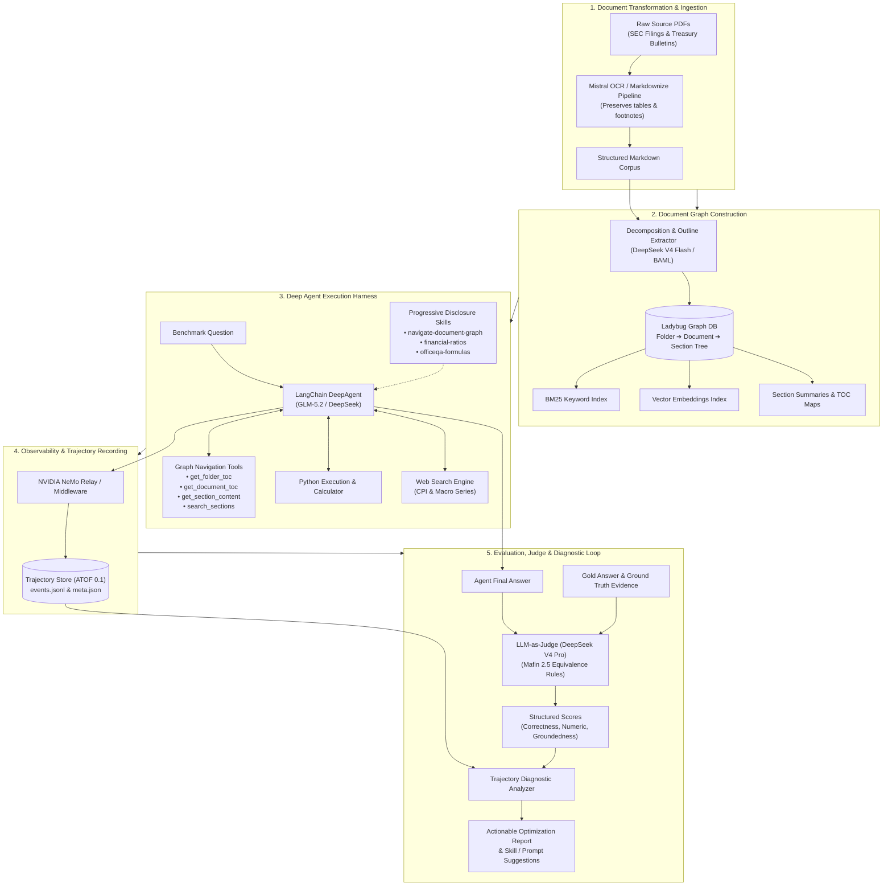
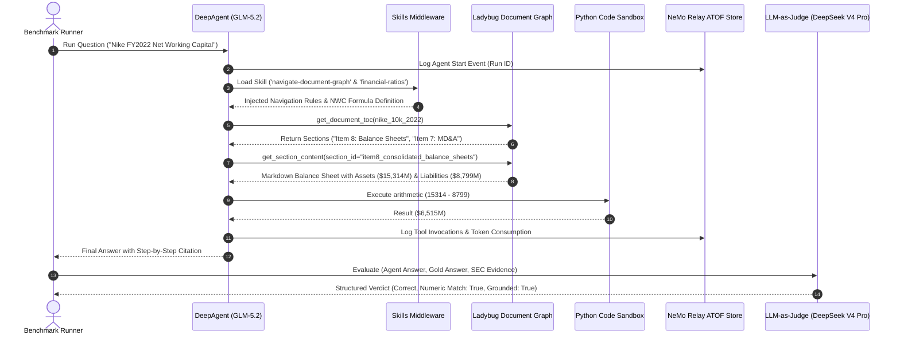

# Technical Architecture & Methodology: Processing FinanceBench and OfficeQA Pro

This document provides a technical deep-dive into how the **GenAI Toolkit (`genai-tk`)** and **GenAI Graph (`genai-graph`)** frameworks processed, evaluated, and analyzed two demanding financial and document QA benchmarks: **FinanceBench** and **OfficeQA Pro**.

---

## 1. Benchmark Challenges and Question Typologies

Both benchmarks test an agentic system's ability to operate as an expert financial research analyst across massive, unstructured document corpuses, but they present fundamentally different document topologies and operational hurdles.

### A. FinanceBench (Corporate SEC Filings)

* **Corpus**: 84 complex SEC filings (10-K, 10-Q, 8-K, and Earnings Releases) from ~30 public corporations (e.g., Apple, Nike, Foot Locker, Microsoft, Walmart, Coca-Cola).
* **Key Difficulties**:
  * **Multi-page Financial Statements**: Financial tables (Balance Sheets, Statements of Cash Flows, Income Statements) often span multiple pages with multi-period comparative columns (e.g., 3-month vs 6-month, restated prior periods).
  * **Critical Footnote Dependencies**: Accounting policies, segment breakdowns, and non-GAAP reconciliations are buried in footnotes far from primary tables.
  * **Rigorous Financial Math**: Computing Operating Working Capital, Free Cash Flow, Net PP&E, Compound Annual Growth Rates (CAGR), and segment margin variances requires precise multi-step formulas.
  * **Temporal Precision**: Distinguishing between fiscal year (FY), fiscal quarter (FQ), calendar year, and restated comparative figures.

#### Representative Question Examples (FinanceBench)

1. **Multi-Step Balance Sheet Calculation (Working Capital)**:
   > *"What is the FY2022 net working capital for Nike, and did it increase or decrease compared to FY2021?"*
   > * *Challenge*: The agent must locate the Consolidated Balance Sheet in the 10-K, extract `Total Current Assets` and `Total Current Liabilities` for both FY2022 and FY2021, calculate $\text{NWC} = \text{Current Assets} - \text{Current Liabilities}$ for each period, determine the delta, and state the direction of change.
2. **Segment Footnote Reconciliation**:
   > *"What was the percentage change in Apple's Services revenue between FY2021 and FY2022, and what primary factors drove this growth according to the MD&A?"*
   > * *Challenge*: Disclosures require extracting exact figures from Note 11 (Segment Information and Geographic Data) and cross-referencing narrative commentary in Management's Discussion & Analysis (MD&A).
3. **Financial Ratio with Footnote Adjustments**:
   > *"What is the FY2018 operating cash flow ratio for Foot Locker?"*
   > * *Challenge*: Requires retrieving Cash Provided by Operating Activities from the Cash Flows statement and dividing by Total Current Liabilities from the Balance Sheet.

---

### B. OfficeQA Pro (Multi-Decade U.S. Treasury Bulletins)

* **Corpus**: 133 questions spanning 9 decades (1939–2025) of historical U.S. Treasury Bulletins, Treasury circulars, and federal financial reports.
* **Key Difficulties**:
  * **Historical Typography & OCR Degradation**: Early bulletins (1930s–1970s) feature typewriter fonts, faded print, multi-column layouts, and tabular ink bleeds.
  * **Archaic Financial Nomenclature**: Changing statutory terminology across eras (e.g., "United States Savings Bonds Series E/F/G", "Marketable Public Debt", "Treasury Bills vs Certificates of Indebtedness").
  * **Statistical & Macroeconomic Math**: Formula-driven calculations including Weighted Average Denomination (bills in circulation), CPI-U base-year index compounding for inflation adjustments, and yield curve spreads.
  * **Multi-Issue Revisions**: Historical figures were frequently revised in subsequent monthly bulletins.

#### Representative Question Examples (OfficeQA Pro)

1. **Historical Archival Lookup (1940s War Finance)**:
   > *"What was the total amount of outstanding U.S. Savings Bonds Series E on December 31, 1945 according to the January 1946 Treasury Bulletin?"*
   > * *Challenge*: Parsing dense, multi-column tables with low OCR contrast and reconciling footnote qualifiers regarding unearned discount adjustments.
2. **Domain-Specific Formula (Weighted Average Denomination)**:
   > *"Calculate the weighted average denomination of United States Currency in Circulation (USCC) for June 1982."*
   > * *Challenge*: Locating the breakdown table of currency denominations ($1, $2, $5, $10, $20, $50, $100, $500, $10,000), multiplying bill counts by face value, summing total value, and dividing by aggregate piece count using precision arithmetic.
3. **Inflation-Adjusted Yield Comparison**:
   > *"What was the inflation-adjusted real yield on 10-year Treasury notes in August 1979 compared to August 1989 using the historical CPI-U series?"*
   > * *Challenge*: Combining nominal yield disclosures from historical bulletins with external CPI time-series data and applying the Fisher equation $r \approx i - \pi$.

---

## 2. End-to-End Architectural Process

The overall system architecture replaces traditional flat-chunk RAG with a **Hierarchical Document Graph**, an **autonomous Deep Agent harness**, **dynamic domain skills**, **trajectory observability**, and an **automated evaluation & diagnostics loop**.

### Detailed Component Breakdown

#### A. Document Transformation to Markdown
- High-density PDFs are converted to Markdown via the `genai-tk` workflow loaders (utilizing Mistral OCR).
- Tables are transformed to Markdown grid tables while preserving headers, column alignments, footnote superscripts, and section headings (`#`, `##`, `###`).
- Preserves exact source text so downstream section content can be sliced and audited without textual drift.

#### B. Hierarchical Document Graph (Ladybug DB)
- The parsed documents are ingested into an embedded **Ladybug** graph database using the schema:
  $$\text{Folder} \xrightarrow{\text{CONTAINS}} \text{Document} \xrightarrow{\text{HAS\_SECTION}} \text{MarkdownSection} \xrightarrow{\text{HAS\_SUBSECTION}} \text{MarkdownSection}$$
- **Content-Addressed Identity**: Documents and sections are keyed by cryptographic content hashes (`xxHash`), enabling deterministic deduplication and provenance tracking.
- **Section Outlines & Summaries**: An LLM (DeepSeek V4 Flash) generates 1-sentence summaries and descriptions for major sections during ingestion.
- **Multi-Index Retrieval**: Every section node is indexed in both a **BM25 full-text engine** (for exact accounting codes and table headers) and a **dense vector store** (for semantic concept matching).

#### C. Deep Agent Harness and Tooling
- Driven by `genai-tk`'s `LangChainHarness` in `type: deep` mode (planning + tool loop + recursion control).
- **Navigation Tools**:
  - `get_folder_toc`: Inspects available filings/bulletins within a corpus directory.
  - `get_document_toc`: Fetches the hierarchical table of contents and section summary trees of a document.
  - `get_section_content`: Fetches the exact Markdown text of a specific section without reading the entire 150-page filing.
  - `search_sections`: Executes filtered BM25 and vector queries scoped to specific documents or folders.
- **Computational Tools**: An integrated Python CodeAct sandbox / Calculator tool executes multi-step arithmetic, preventing LLM token-generation calculation errors.
- **Web Search**: Used selectively for macroeconomic external series (such as CPI adjustments for historical Treasury bulletins).

#### D. Progressive Disclosure Skills
Rather than bloating the base system prompt, domain guidance is delivered on-demand via the `SkillsMiddleware`:
- `navigate-document-graph`: Teaches the agent the *orient $\rightarrow$ map $\rightarrow$ read $\rightarrow$ search $\rightarrow$ iterate* navigation heuristic.
- `financial-ratios`: Defines exact GAAP/non-GAAP equations (Working Capital, FCF, Quick Ratio, Net Debt, ROIC) and reporting conventions.
- `officeqa-formulas`: Provides domain-specific formulas (USCC weighted averages, yield curve spreads, series compounding).

#### E. Trajectory Observability (NVIDIA NeMo Relay & ATOF)
- Every agent invocation is instrumented using **NVIDIA NeMo Relay**.
- Emits an **Agent Trajectory Observability Format (ATOF 0.1)** event stream saved locally to `data/trajectories/<run_id>/`:
  - `events.jsonl`: Step-by-step stream of LLM generations, tool arguments, tool outputs, and skill load events.
  - `meta.json`: Summary metadata (run status, prompt/completion tokens, total tool calls, latency).
- Provides complete forensic visibility into agent reasoning loops and search patterns via `cli trajectory show <id>`.

#### F. LLM-as-Judge Evaluation (Mafin 2.5 Equivalence)
- An independent evaluator model (**DeepSeek V4 Pro**) grades answers against benchmark gold references.
- Uses **Mafin 2.5 equivalence rules**:
  - **Numerical Equivalence**: Fractions, percentages, decimals, and rounding tolerances (e.g., $11/14 \equiv 78.6\% \equiv 0.79$) are recognized as identical.
  - **Superset & Substantive Correctness**: If the agent's response contains or strictly implies the gold claim with verified justification, it is marked `correct`.
  - **Structured Grading Output**: Produces a typed JSON verdict with `correctness`, `numeric_match`, `groundedness`, `error_category`, and `rationale`.

#### G. Trajectory Diagnostics & Error Analysis
- An automated diagnostic analyzer inspects the captured ATOF trajectories of failed or partial runs.
- Categorizes bottlenecks into:
  1. *Search Looping Penalty* (excessive repeated queries across TOCs).
  2. *Missing OCR/Chart Extraction* (unparsed visual figures in scanned PDFs).
  3. *Calculation/Math Divergence* (manual token arithmetic instead of Python execution).
  4. *Context Ceiling / Premature Halting*.
- Generates targeted recommendations for skill refinement, prompt tuning, and section summarization.

#### H. Parallel Workflow Orchestration (Prefect Engine)
- The entire benchmark pipeline is driven by **Prefect flows** with custom concurrency gates:
  - Parallel document fetching and OCR conversion.
  - In-process thread-safe batch graph construction respecting Ladybug's single-writer database constraints.
  - Parallel agent question execution and batch LLM grading with rate-limiting semaphores.

---

## 3. Technical Stack

| Component / Technology | Role / Short Description | Key Rationale |
|---|---|---|
| **LadybugDB** | Embedded Graph Database (maintained Kuzu fork) | Ultra-fast embedded Cypher graph queries without server overhead; native multi-table joins and zero-latency section lookups. |
| **LangChain / DeepAgents SDK** | Autonomous Agent Orchestration Runtime | Provides multi-step planning, stateful scratchpad memory, tool routing, and recursive execution control. |
| **NVIDIA NeMo Relay** | Trajectory Observability & Telemetry Framework | Emits standard ATOF (Agent Trajectory Observability Format) event streams for transparent auditing and debugging. |
| **BAML (Boundary ML)** | Type-Safe Structured LLM Extraction Engine | High-throughput, robust parsing of document outlines, metadata, and structured evaluation verdicts. |
| **Mistral OCR** | High-Fidelity Multimodal Document Parser | Accurately extracts multi-page financial tables, multi-column layouts, and footnote markers into clean Markdown. |
| **DeepSeek V4 Flash** | Document Decomposition & Section Summarization LLM | Extremely fast and cost-effective model for generating section outlines and summaries during graph building. |
| **GLM-5.2 / DeepSeek** | Primary Deep Agent Reasoning Engine | Strong reasoning, long-context understanding, and reliable multi-turn tool calling. |
| **DeepSeek V4 Pro** | Independent LLM-as-Judge Evaluator | Unbiased, high-accuracy reasoning model for evaluating financial answers against gold standards under Mafin 2.5 rules. |
| **Prefect** | Workflow Engine & Pipeline Orchestrator | Resilient task retry handling, asynchronous parallel batching, and transparent stage progress monitoring. |
| **OmegaConf & Pydantic v2** | Typed Configuration & Data Validation | Strict data validation, hierarchical YAML profiles, and dynamic environment variable interpolation. |
| **UV** | Fast Python Package & Virtualenv Manager | Deterministic lockfiles, sub-second dependency resolution, and rapid reproducible execution. |

---

## 4. Main Python Packages from `genai-tk` and `genai-graph`

| Package / Module | Role / Short Description | Technical Rationale |
|---|---|---|
| `genai_tk.core.factories` | Unified LLM & Embeddings Factory (`get_llm`, `get_embeddings`) | Model-agnostic provider abstraction (`name@provider` syntax) with built-in caching, fallbacks, and cost tracking. |
| `genai_tk.agents.harness` | Deep Agent Execution Harness (`LangChainHarness`) | Manages agent lifecycles, event streaming, recursion limits, and runtime tool injection. |
| `genai_tk.utils.trajectory_store` | ATOF Trajectory Store & CLI Reader | Reads, parses, filters, and diffs local JSONL agent trajectory logs. |
| `genai_tk.workflow.markdownize` | PDF to Markdown Conversion Pipeline | Standardized document transformation supporting multiple OCR engines and profile levels. |
| `genai_tk.config_mgmt` | Configuration Manager (`global_config()`) | Centralized, type-safe configuration singleton supporting runtime profile switching (`pytest`, `bench`, `prod`). |
| `genai_graph.kg.document_graph` | Hierarchical Document Graph Ingestion Engine | Decomposes Markdown files into `Folder ➔ Document ➔ MarkdownSection` nodes and compiles graph databases. |
| `genai_graph.kg.backend` | Graph Storage Interface (`KuzuBackend` / Ladybug) | Encapsulates Cypher execution, transaction handling, and schema creation in Ladybug. |
| `genai_graph.kg.query.document_graph_tools` | Cypher-Backed Document Navigation Tools | Exposes schema-tolerant, read-only graph query tools (`get_document_toc`, `get_section_content`, `search_sections`). |
| `genai_graph.agent.docgraph_agent` | Document Graph Agent Wiring & Skill Injector | Assembles agent profiles, attaches database connections, and registers navigation skills at runtime. |
| `genai_graph.orchestration` | Prefect Pipeline Steps for Knowledge Graphs | Prefect-wrapped tasks for graph compilation, outline extraction, and batch indexing. |

---

## 5. Problems Encountered & Lessons Learned

Analyzing hundreds of evaluation runs across both benchmarks revealed several non-obvious engineering insights:

### 1. The Search Loop & Token Penalty
* **Problem**: When an agent failed to find an exact keyword match in a 150-page filing, it often entered repetitive search loops (calling `search_sections` and `get_document_toc` up to 70 times), driving input token consumption from an average of ~190k tokens on successful runs to over **4.2M tokens** on failed runs.
* **Lesson Learned**:
  * Implement **Section Summaries**: Ingesting LLM-generated section summaries into the graph reduced token consumption by **59.1%** and increased exact accuracy by **+19.4%** because the agent could match high-level intent without full-text trial-and-error.
  * Enforce **Adaptive Loop Dampening**: Terminate or steer agent search patterns when repetitive queries yield duplicate section IDs.

### 2. LLM Judge Reasoning Ceiling Exhaustion
* **Problem**: In OfficeQA Pro, the judge model (`DeepSeek-V4-Pro`) was invoked in JSON mode. Being a reasoning model, its internal chain-of-thought tokens exceeded 2,900 tokens on difficult historical questions, hitting the provider's hard 8,192 token limit and truncating the JSON output.
* **Lesson Learned**:
  * When using reasoning models for structured evaluation, explicitly configure `reasoning: { effort: "low" }` or set high completion token buffers.
  * Use Pydantic schema validation with automatic retry fallbacks for JSON extraction.

### 3. Historical OCR and Layout Degradation
* **Problem**: OfficeQA Pro accuracy dropped significantly in the 1970s and 1980s bulletins due to degraded multi-column layouts and visual charts where underlying numerical plot tables were absent.
* **Lesson Learned**:
  * Standard OCR is insufficient for visual chart comprehension; multimodal vision models must be introduced to extract raw coordinates from historical plots.
  * Historical corpora require specialized normalizers for archaic table headings and obsolete terminology.

### 4. Vectorless Navigation Beats Flat Chunking for Financial Reporting
* **Problem**: Standard chunk-and-embed RAG frequently splits balance sheets and loses footnote cross-references.
* **Lesson Learned**:
  * Vectorless graph navigation (walking the document's Table of Contents and fetching full section Markdown) achieved **96.0% accuracy** on FinanceBench and **100% numerical reasoning accuracy** on standalone calculations.
  * Preserving natural section boundaries maintains table integrity and guarantees 100% auditable citation provenance.

### 5. Delegating Arithmetic to Code Execution
* **Problem**: LLMs reliably extract correct financial numbers from tables but frequently commit subtle errors when performing multi-term addition, compounding, or division directly in prompt generation.
* **Lesson Learned**:
  * Forcing agents to offload all math to an integrated Python execution tool / calculator yielded **100% accuracy (43/43)** on pure arithmetic tasks across SEC filings.
