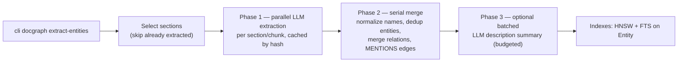

# LightRAG-Inspired Entity & Relation Extraction over the Document Graph

**Status:** proposal / design report — not yet approved for implementation.
**Scope:** a corpus-scale entity/relation layer built on top of the existing Document Graph (Folder → Document → MarkdownSection → SectionChunk), inspired by LightRAG (HKUDS, EMNLP 2025) and benchmarked against how NanoIndex (NanoNets) solves the same problem.

---

## 1. Motivation and honest framing

The Document Graph pipeline (`genai_graph/kg/document_graph/`) is state-of-the-art on our benchmarks through **vectorless agentic navigation**: the agent reads the TOC, picks sections, opens them. That is a *single-document, structure-first* strategy, and it is where we should not invent complexity.

The gap is different: **corpus-scale, cross-document, entity-centric questions**.

- "Which entities appear across all Treasury Bulletins for 1948, and where?"
- "Find every filing mentioning Acme Corp's guarantee obligations, and jump straight to the clauses."
- Fast lookups that should not cost a 5–8 call agent walk (NanoIndex's `fast` mode answers in 2 LLM calls by doing graph entity lookup first).

Today the only retrieval surfaces are BM25 + HNSW over sections/chunks (`retrieval.py`) and agent navigation. There is no entity node to anchor on, no entity→section provenance edge, and no relation graph to expand multi-hop. This report proposes adding exactly that — no more.

**What this is not:** it is not expected to raise FinanceBench / MMLongBench single-doc scores materially. The agent already navigates those documents better than a flat entity index would. The value is new capability (corpus queries, entry points, cheap lookups), not benchmark delta. Any proposal claiming otherwise should be rejected.

---

## 2. What LightRAG actually does (source-verified)

From `lightrag/operate.py`, `lightrag/lightrag.py`, and the EMNLP paper:

1. **Chunking** — fixed token windows, default 1200 tokens with 100 overlap (optional recursive/semantic/paragraph splitters).
2. **Per-chunk LLM extraction** — one prompt per chunk extracts entities (`name`, `type`, `description`) and relations (`source`, `target`, `description`, `keywords`). Default output format is a custom delimiter protocol (`<|#|>` separated tuples), JSON mode optional. Followed by an optional **gleaning** round (`max_gleaning=1` default): a second call asking "what did you miss?". Caps: ≤100 records and ≤40 entities per response, entity names truncated at 256 chars.
3. **Merge** — entities deduplicated by normalized (lowercased) name; on merge, the list of descriptions is **re-summarized by LLM** using a map-reduce scheme (`_handle_entity_relation_summary`), gated by `force_llm_summary_on_merge`. Source chunk ids are accumulated per entity, capped.
4. **Indexing** — three vector stores: entities (name+description), relations (description), chunks. Graph in NetworkX/Neo4j/Kuzu, KV store for chunks.
5. **Retrieval** — dual-level: an LLM first converts the query into low-level (entity-specific) and high-level (topic) keywords; vector search over entity/relation descriptions; graph expansion to neighbor chunks; optional reranker. Query modes: naive / local / global / hybrid / mix.

Two details worth noting as validation for us: recent LightRAG **injects the chunk's heading path as "Section Context"** into the extraction prompt (`entity_extraction_section_context`) — i.e., they are retrofitting the structural context we already have natively. And the codebase carries an entire module (`fix_tuple_delimiter_corruption`) to repair their delimiter format's failure modes — a whole bug class that structured output eliminates.

## 3. What NanoIndex does, and why it matters here

NanoIndex builds a TOC tree (like our docgraph) **plus an entity graph**, and — notably — it reached the same conclusion as the one in this proposal's premise:

- **Fast path:** entities/relationships are extracted by the *same LLM call that indexes the document hierarchy* (`build_graph_from_hierarchy` in `graph_builder.py`; commit `c53a9ab` "Build entity graph from API entities instead of local NER").
- **GLiNER + spaCy is only the fallback** when API-extracted entities are absent. The instinct "GLiNER looks unnecessary if we already pass docs to the LLM" is literally the direction NanoIndex took. Agreement.
- Entity resolution is pragmatic: lowercase key, legal-suffix stripping (`Inc`, `Corp`, `LLC`, …), `SequenceMatcher` ratio > 0.9 for near-duplicates. Relationship types pass through a hand-built synonym table (`is_cfo_of` → `works_for`) and a noise drop-list (`related_to`, `?`).
- Extra deterministic edges: cross-references (`Section 3.1`, `Note 7`, `Item 1A`) resolved by regex into graph edges — cheap and effective for legal/SEC corpora; worth copying later.
- The entity graph is used to **seed agent navigation** (`agentic_graph` mode), not as a replacement retrieval stack.

---

## 4. Critical assessment of the idea

**Where the idea is right:**

- The missing pieces are small and we own all the hard parts already: chunking (`chunker.py`), LLM call infrastructure with batching/retries/warnings (`summarize.py`), hybrid search (`retrieval.py`), idempotent merge primitives (`merge_nodes_batch` / `merge_relationships_batch`), per-section provenance with exact line ranges, parallel workers over a shared DB (`SharedKuzuParallel`).
- BAML is a strictly better extraction substrate than LightRAG's delimiter protocol: typed schemas, server-side structured output, retries, no corruption-repair module.
- Section-based extraction beats LightRAG's blind 1200-token windows: our chunks carry heading context, language detection, and table handling for free.

**Where I disagree with the framing or with LightRAG's choices (do not copy blindly):**

1. **Do not import LightRAG's retrieval machinery.** Dual-level keyword extraction, five query modes, separate entity/relation vector stores — that is a second retrieval stack to maintain, and it duplicates our existing hybrid search. The delta we actually need is: an `Entity` node table, `MENTIONS` provenance edges, `RELATED` edges, and entity-level embedding + FTS indexes built with the *same* Ladybug primitives. Entity retrieval = hybrid search over `Entity`, graph expansion = Cypher traversal. Nothing more.
2. **Do not copy eager LLM re-summarization on merge.** LightRAG re-summarizes an entity's concatenated descriptions with map-reduce every time it grows. On a 700-document corpus this is a significant recurring cost and a write-amplification problem. Alternative: store per-mention descriptions on the `MENTIONS` edges, and derive the entity `description` at write time by concatenating top-K distinct mentions (deterministic, free), LLM-summarizing lazily and batched only when the concatenation blows a token budget.
3. **Gleaning: skip (config-gate for later).** It doubles extraction cost for marginal recall. LightRAG needs it because their chunks are context-free slices; our sections are coherent units with headings. Revisit only if eval shows recall problems.
4. **Entity resolution is where the real complexity hides — budget for it, don't hand-roll it.** Strict normalized-name merge (LightRAG) fragments entities ("Apple Inc." vs "Apple"). NanoIndex's fuzzy O(n²) per-document matching is fine per doc but is not a corpus-scale answer either. Phase 1: normalization only (casefold, whitespace/punctuation collapse, legal-suffix strip for organizations). Phase 2 (only if fragmentation shows up in eval): embedding-similarity candidate pairs (we already have `EmbeddingsHandler` + HNSW) with a single batched LLM adjudication call per candidate set. Full-blown entity resolution is a known research tar pit; do not enter it in v1.
5. **Cost is the real constraint, and "we already call the LLM" is only half true.** The outline/summarize passes touch *some* sections (substantial ones get summaries; tables are truncated in prompts). Covering all sections/chunks with extraction is a new, full-corpus LLM pass. Order-of-magnitude: OfficeQA Pro (~89k pages) ≈ 30k+ sections ≈ 30k+ extraction calls at section granularity, plus output tokens. Fine on a cheap configured model (we route per-LLM already), unpayable on a frontier reasoning model. This must be a config choice, cached per section hash, and never silently re-run.

---

## 5. Alternatives considered

### A. Standalone `KgFactory` reading Markdown files (a "LightRagFactory" à la `MarkdownBamlFactory`)
The literal "new graph factory" reading. **Rejected as the engine.** A factory loads *source data* and extracts; entity extraction over the docgraph is a *derived index over already-ingested content*. A markdown-reading factory would re-parse files, re-chunk them (diverging from `SectionChunk`), and collapse provenance to document level (like `DocumentMixin`'s `MENTIONS` Document→entity), losing section/chunk granularity that is the whole point. It also can't reuse `SharedKuzuParallel` or section-level caching.

### B. During-ingest extraction (`EntityExtractionConfig` beside `RetrievalConfig` in `ingest_document_graph`)
Consistent with how retrieval augments the build, and the ingest phases (parallel embed → serial merge) already have the right shape. **Rejected as default** because it couples an expensive LLM pass to structural ingest: `--force` rebuilds would re-pay extraction (cache mitigates but complicates), and you cannot run it on existing SOA graphs without a rebuild. Keep as a *wiring option* later (build workflow chains it after ingest), not as the home.

### C. Post-pass over the built docgraph, mirroring `summarize_graph` — **RECOMMENDED**
`extract_entities_graph(db_path, config, force, dry_run, workers)` + `cli docgraph extract-entities`. Reads `MarkdownSection` rows (chunking long ones with `chunk_section_text`), parallel LLM fan-out with per-section caching, serial merge into `Entity` tables. This inherits the entire `summarize.py` pattern: config model, batching, retry-on-length-limit, warnings accumulation, `SharedKuzuParallel` (with the serial-merge caveat in §6.3), incremental skip of already-extracted sections. It runs on today's SOA graphs with zero rebuild, and `cli docgraph build --entities` can chain it for one-command UX.

### D. Piggyback on the existing outline/summarize calls (the NanoIndex fast path)
Zero additional LLM calls: extend `DocumentOutline`/`DocumentIndex` with entity lists per section. **Not recommended as the primary mechanism.** The outline call is already output-budget-constrained (`output_budget_tokens`, brevity enforced three times over); adding 40 entities + relations per section would either starve it or degrade summary quality (task interference). It also only covers sections the outline pass covers, with table content truncated. Where it *is* interesting: a cheap entity-*index* mode (names + types only, no descriptions/relations) for cost-sensitive builds — a future `entity_source: piggyback | dedicated` config, evaluated separately.

### E. GLiNER (nanoindex-style NER) — rejected, agreeing with the premise
No relations, no descriptions, a second model + runtime to maintain, and we already pay for LLM passes that see the text. Its one genuine advantage — near-zero marginal cost per token — only matters if we wanted to extract from chunks the LLM never sees; we don't.

### F. Do nothing (agent navigation is enough)
The honest baseline for the current single-doc benchmarks. For corpus-scale use it loses: nothing anchors a query on an entity, and multi-hop requires the agent to brute-force `search_sections`. This report assumes §1's framing holds.

---

## 6. Proposed design

### 6.1 Schema (generic entity layer, docgraph-adjacent)

One generic `Entity` node table — this matches LightRAG (closed, configurable type list passed into the prompt) and NanoIndex (domain-adaptive label list), and avoids schema explosion across domains. Typed domain extraction already exists and stays the right tool when the schema is curated (`MarkdownBamlFactory` path).

```python
# genai_graph/kg/nodes/entity.py  (new)
class Entity(BaseModel):
    entity_id: str          # normalized_name (primary key)
    name: str               # display form, first seen
    normalized_name: str
    type: str               # from configured closed list, e.g. person|organization|location|event|product|metric|regulation
    description: str | None # derived: top-K mention descriptions (see §4 point 2), lazily LLM-summarized over budget
    mention_count: int
    language: str | None    # dominant language of mentions

EntityNode = GraphNode(node_class=Entity, name_from="name", key_from="entity_id",
                       embedding_field="description")   # Pattern 5 reuse

MENTIONS    = GraphRelation(MarkdownSection → Entity,  # provenance; properties: chunk_ids, weight, description
                            name="MENTIONS")
RELATED     = GraphRelation(Entity → Entity,           # properties: rel_type, description, section_ids
                            name="RELATED")
```

Retrieval: HNSW on `Entity.description` embedding (same mechanism as `SectionChunk.chunk_embedding`) + FTS over `Entity(name, description)` via the existing `CREATE_FTS_INDEX` path with language-aware stemmer/stopwords.

⚠️ Integration detail to verify in phase 1: `DocumentMixin.get_document_schema_elements()` already emits a `MENTIONS` relation (Document→root entity) for the BAML factories. Kuzu distinguishes relationship tables by endpoint pair, but the schema registry's relation merging must be checked for same-name collisions; if it objects, name ours `SECTION_MENTIONS` (or rename the mixin's).

### 6.2 Extraction (BAML)

New `genai_graph/baml_src/entity_extraction.baml`:

```
class ExtractedEntity  { name string, type string, description string }
class ExtractedRelation{ source_name string, target_name string, rel_type string, description string }
class SectionExtraction{ entities ExtractedEntity[], relations ExtractedRelation[] }

function ExtractSectionEntities(filename, section_title, heading_path, section_text, entity_types) -> SectionExtraction
```

- Per **section** by default (1 call per non-trivial section; sections over the chunk budget may issue one call per chunk — config `max_section_tokens` decides). Heading path injected like LightRAG's section context; tables sampled with `_truncate_section_text`-style trimming (reuse from `summarize.py`).
- Closed `entity_types` list from config (LightRAG's `entity_types` pattern); relation post-processing copies NanoIndex's pragmatic normalization: snake_case, synonym table, drop-list (`related_to`, self-loops, unknown endpoints).
- No gleaning in v1. Cache keyed by section content hash (sections are already content-addressed via `section_id = {markdown_hash}::{idx}`), mirroring `MarkdownBamlFactory`'s JSON cache.

### 6.3 Pipeline (post-pass, ingest-shaped)



- **Phase 1 parallel, Phase 2 serial** — same split as ingest's embed/merge phases. This is not cosmetic: concurrent workers merging the *same* entity (two documents mentioning Acme) would violate the disjoint-row constraint that `SharedKuzuParallel` relies on (see `summarize.py`'s dedup-by-markdown_hash comment). LLM calls are the slow part and parallelize freely; entity merges are fast local Arrow writes.
- **Incremental by construction:** re-running extracts only sections without `MENTIONS` edges (or with `--force`). New documents extend the corpus graph; entity identity is corpus-global by `normalized_name` — this is what makes it cross-document rather than per-document.
- Config: `EntityExtractionConfig(BaseModel)` — llm id (default from `kg_build.llms`), `entity_types`, `min_section_tokens`, `max_section_tokens`, `max_output_tokens`, `workers`, description budget, thresholds. CLI: `cli docgraph extract-entities [--llm …] [--types …] [--force] [--dry-run]`, plus a `--entities` flag on `docgraph build` chaining the pass.

### 6.4 Query / agent surface (phase 2)

- Extend hybrid search to entities (BM25 + vector over `Entity`).
- Agent tools beside the docgraph ones: `find_entities(query, type?)`, `get_entity_neighborhood(entity_id, depth)`, `get_entity_sections(entity_id)` (resolving MENTIONS → section → exact lines). These are thin Cypher wrappers in the style of `document_graph_tools.py`.
- Explicitly *not* in scope: LightRAG-style dual-level keyword query planning, Leiden/Louvain communities, GraphRAG map-reduce global search. Revisit only if corpus evals demand them.

---

## 7. Risks

- **Entity fragmentation** (aliases, translations — our corpora are multilingual and `detect_language` exists per document; same entity in French and English filings will not merge). Accept in v1; measure; phase-2 embedding+LLM adjudication if the eval shows it matters.
- **Relation noise.** Relation extraction is the weakest part of every system in this family (LightRAG's descriptions are noisy; NanoIndex needs a synonym/drop-list to be usable). Treat relations as a navigation aid for the agent (never as ground truth), sample-audit 50 relations before trusting them.
- **Cost on corpus-scale builds.** Mitigated by cheap-model routing, section-level calls, per-section cache, and the piggyback mode as a future experiment — but it must be measured, not assumed (§8).
- **Prompt/output budget dilution** if we later try the piggyback mode — keep the two mechanisms separable.
- **Schema collisions** (`MENTIONS`) — see §6.1.

## 8. Evaluation plan (gate each phase)

1. **Quality probe (phase 0):** extract from ~10 docs across FinanceBench/OfficeQA/MMLongBench; eyeball entities/relations; measure entities/doc, fragmentation rate (obvious duplicate clusters), table-section behavior. Kills or confirms the idea cheaply.
2. **Cost:** extraction calls & tokens per 1k pages on the cheap configured model; compare vs. outline+summarize baseline.
3. **Retrieval delta (phase 2):** build a small corpus-level question set (cross-doc aggregation, multi-hop — OfficeQA Pro style) and compare hybrid-search baseline vs. entity-anchored retrieval (hit-rate@k on sections, end-to-end agent accuracy, agent LLM calls — the "fast lookup" claim should show up as fewer agent turns).
4. Only then decide whether to wire into `cli bench` profiles.

## 9. Phased plan

- **Phase 0 — Spike:** BAML schema + prompt, run on ~10 docs via a notebook/script; eyeball output quality. No graph writes. (Day-scale.)
- **Phase 1 — Post-pass MVP:** `nodes/entity.py`, `document_graph/entity_extract.py` (extraction + merge, ingest-shaped two-phase), `EntityExtractionConfig`, CLI `docgraph extract-entities`, HNSW+FTS on Entity, per-section cache, unit tests (fake LLM boundary like `_call_llm` in `summarize.py`). (Few days.)
- **Phase 2 — Retrieval & agent:** entity hybrid search, agent tools, eval per §8.3, `--entities` chaining on `docgraph build`.
- **Phase 3 — Only if eval demands:** embedding-candidate entity resolution with LLM adjudication; piggyback mode; gleaning experiment; deterministic cross-reference edges (NanoIndex's regex pattern); optional thin `EntityGraphFactory` view (schema + queries, *not* extraction) if registry composition with other `KgFactory`s is wanted for `cli kg create` workflows.
