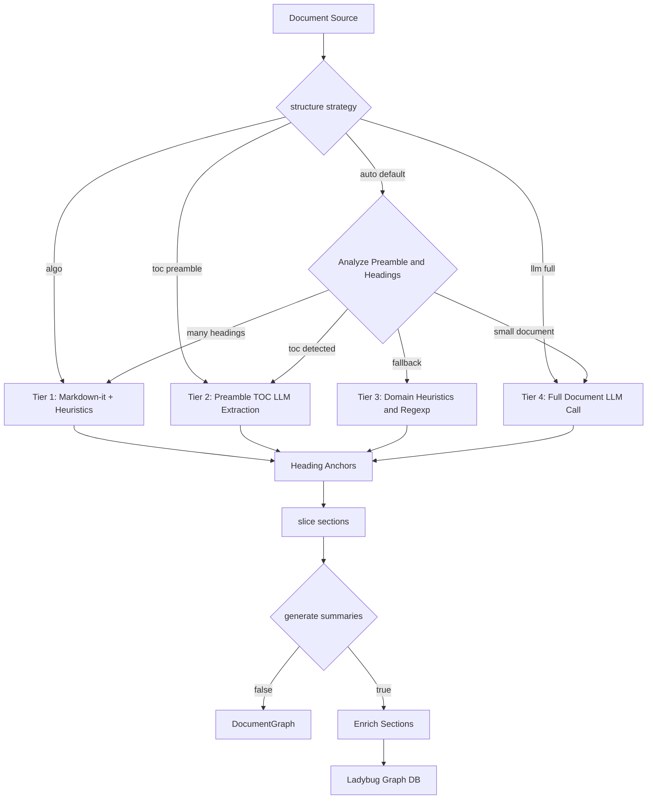

# Document Decomposition & Enrichment Guide

This document describes the multi-tier architecture used in **genai-graph** and **genai-tk** to decompose documents into structured section hierarchies (`Folder → Document → MarkdownSection`) and enrich them with LLM-generated routing descriptions and summaries.

---

## 1. Overview & Problem Statement

Large documents (SEC 10-K/10-Q filings, Treasury Bulletins, legal contracts, reports) vary dramatically in their source structure:
1. **Clean Markdown**: Documents with explicit `#`..`######` heading hierarchies.
2. **Printed Preamble Table of Contents (TOC)**: Documents (like OCR-converted PDFs or EDGAR filings) that have no markdown `#` markers in the body, but possess a rich printed Table of Contents at the beginning (e.g. pages 1–5 / lines 1–350).
3. **Unstructured / Domain Pattern Text**: Documents lacking both markdown markers and a formal printed TOC, but containing domain structural markers (`PART I`, `ITEM 1A`, `NOTE 3`, `TABLE FFO-1`, financial statement titles).
4. **Short / Freeform Documents**: Plain prose requiring an LLM to discover implicit sections.

Previously, using a single full-document LLM call was both token-expensive on 100k+ token documents and prone to hitting context-window safety thresholds (causing silent degradation to unsummarized algorithmic parsing).

---

## 2. The Multi-Tier Decomposition Strategy

The decomposition pipeline uses a multi-tier fallback cascade:



---

### Tier 1: Native CommonMark (`markdown-it-py`)
- **When used**: Hand-crafted Markdown or converters that emit consistent `#`..`######` headings.
- **Mechanism**: Parses AST tokens with `markdown-it-py` to ignore headings inside code blocks, blockquotes, or tables.
- **Cost**: 0 LLM calls, instantaneous.

---

### Tier 2: Preamble TOC Extraction (`toc_preamble`)
- **When used**: Documents containing a Table of Contents near the top (detected by `_TOC_HEADER_RE` in the first 500 lines) but lacking rich `#` headings in the body.
- **Mechanism**:
  1. `_extract_toc_excerpt(raw)` extracts candidate TOC lines (first ~250–350 lines).
  2. A lightweight/flash model extracts a structured `DocumentTocPreamble` containing ordered `TocPreambleEntry(title, level, page)`.
  3. `anchor_toc_preamble` scans the document body following the TOC block to anchor each title to its exact line number.
- **Cost**: ~1,000–2,000 input tokens total, even for 100,000+ token documents.

---

### Tier 3: Domain Pattern Heuristics
- **When used**: Filings without markdown `#` markers or printed TOC blocks.
- **Mechanism**: Uses `_HEURISTIC_HEADING_RE` in `tree_parser.py` to recognize:
  - Document structural prefixes: `PART`, `ITEM`, `SECTION`, `CHAPTER`, `NOTE`, `EXHIBIT`, `APPENDIX`.
  - Tabular listings & charts: `TABLE FFO-1`, `CHART A`, `SCHEDULE 14A`.
  - Financial statements: `CONSOLIDATED STATEMENTS OF OPERATIONS`, `BALANCE SHEETS`, `BILAN`.
  - Standalone multi-word uppercase titles surrounded by blank lines.

---

### Tier 4: Full-Document LLM Extraction (`llm_full`)
- **When used**: For short-to-medium documents ($< 35\text{k}$ tokens) when full structural discovery is explicitly requested.
- **Mechanism**: Condenses tables and runs full prompt through the LLM.

---

## 3. Decoupling Structure Discovery from Summarization

The configuration cleanly separates **how sections are discovered** from **whether they receive LLM descriptions and summaries**:

### In `config/bench.yaml`:

```yaml
bench_profiles:
  mistral_glm:
    llms:
      agent: glm_5.2@openrouter
      build: deepseek-v4-flash-0731@openrouter
      judge: DeepSeek-V4-Pro-0813@openrouter

    build:
      skip_ocr: false
      force: false
      llm: deepseek-v4-flash-0731@openrouter  # Model used for LLM build operations
      structure_strategy: auto                # auto | algo | toc_preamble | llm_full
      summaries: true                         # true = generate descriptions & summaries; false = structure only
      workers: 4
      summary_min_tokens: 800                 # threshold for generating detailed paragraph summaries
      context_safety_ratio: 0.9
      embeddings: qwen3_06b@deepinfra         # SectionChunk vector model (null = no vector leg)
      fts: true                               # BM25 full-text search index over MarkdownSection
      chunk_size_tokens: 1500
```

### In Python / Workflows:

```python
from genai_graph.orchestration.document_graph_flow import document_graph_flow

result = document_graph_flow(
    sources=["./data/markdown_multi"],
    db_path="./data/kg/officeqa.db",
    llm="deepseek-v4-flash-0731@openrouter",
    structure_strategy="auto",   # or "toc_preamble", "algo", "llm_full"
    generate_summaries=True,
    summary_min_tokens=800,
    workers=4,
)
```

---

## 4. Summary & Description Roles in Agent Navigation

When `summaries: true` is enabled:
1. **`description` (One Sentence, $\le 20$ words)**:
   - Generated for **every section**.
   - Acts as the primary **routing signal** when an agent inspects the document TOC via `get_document_toc`.
   - Strips redundant restatements (e.g. if the title is "Executive Officers", a description repeating "Lists executive officers" is dropped to null).
2. **`summary` (Short Paragraph, $\le 60$ words)**:
   - Generated only for substantial sections ($\ge 800$ tokens).
   - Acts as the **triage signal** for an agent deciding whether to load the full section content with `get_section_content`.
