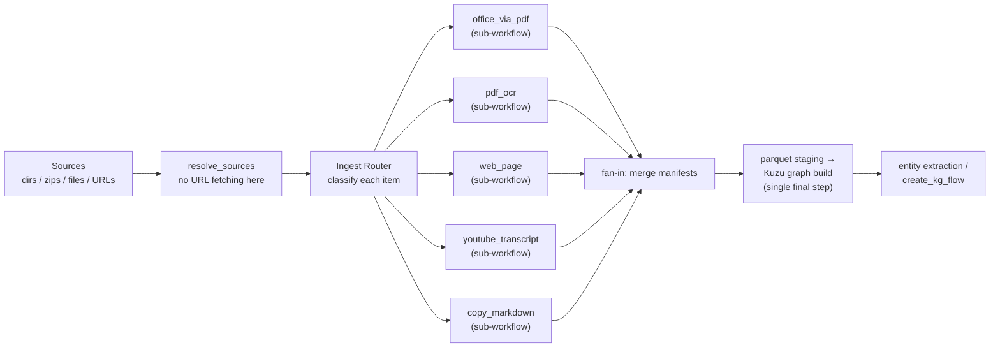

# Orthogonal Document Ingestion: Rule-Selected YAML Workflows

## Purpose

This note studies how to make document-graph creation **orthogonal**: today the pipeline that turns raw sources into a Document Graph is hard-coded Python with parameters selecting behaviour (markdownize profile, implicit Office→PDF via LibreOffice, whether the document graph is built at all). It works for the bench, but adding new source kinds — web pages, YouTube transcripts, etc. — means touching Python orchestration every time.

The proposal: reuse the pattern we already have for converter selection (`MarkdownizeProfile` pathspec rules) one level up, so that **rules select a whole YAML workflow** (defined in the genai-tk workflow DSL) instead of selecting a converter inside one hard-coded flow. Workflows then compose the primitives we already ship (markdownizer, LibreOffice, OCR, …) and run in parallel.

---

## Executive Summary

- Document-graph ingestion currently mixes three concerns in one place: **source discovery**, **per-file routing**, and **pipeline orchestration**. Routing exists (`MarkdownizeProfile`), orchestration exists (genai-tk workflow DSL), but they are not connected: routing selects *converters inside a single flow*, not *pipelines*.
- The proposed **Ingest Router** applies ordered, gitignore-style pathspec rules (the same matching semantics as `ConverterRule`) to each source item and selects a **YAML workflow + parameters**. Matched groups run as parallel Prefect sub-workflows; a single fan-in step ingests the normalized Markdown into the graph.
- New source kinds become **new YAML workflows plus one rule** — no Python orchestration changes. A `web_page` workflow (fetch → readability → Markdown) and a `youtube_transcript` workflow (yt-dlp → Markdown) are the first targets.
- The router is a small, generic component; everything heavy already exists: the DSL compiler/executor, `PrefectFlowFactory`, manifest caching, and the document-graph builder. The two anticipated constraints turned out manageable: the Kuzu **single-writer fan-in** disappeared entirely once graph building moved to a parquet-first pipeline (upstream workflows only produce Markdown; Kuzu is written once at graph-build time), and **URL routing** required only a small fetch abstraction (Tavily / BeautifulSoup) behind a `web_page` workflow.

---

## Current State

### What exists and where the hard-coding lives

**1. Converter routing inside one monolithic flow.** `MarkdownizeProfile` (`genai_tk/extra/markdownize/selector.py`) holds an ordered list of `ConverterRule(pathspec, converter)` using gitignore-style patterns with brace expansion; `select_route()` returns a converter name or a special route (`copy`, `via_pdf`), falling back to `markitdown`. Profiles live in `config/markdownize.yaml` (`fast`/`medium`/`best`/…). This is the pattern the user wants to generalize.

**2. Hard-coded pipeline orchestration.** `docgraph_build_step` (`genai_graph/orchestration/workflow_steps.py`) and the bench flows (`genai_graph/bench/flows.py`, `build_graph.py`) hard-code the stage order: *markdownize → entity KG build → document graph build*. Behaviour is selected by parameters (`markdownize_profile`, `md_output_dir`, `build_document_graph: bool`, `include=['*.md']`, …). Special cases are baked in: `via_pdf` triggers a LibreOffice task inside `markdownize_flow` (`genai_tk/workflow/markdownize/flow.py`), PDF OCR has hard-coded fallback chains (mistral → anydoc → markitdown), and non-Markdown inputs such as the bench's JSON source handling live in `markdownize_target`.

**3. A YAML DSL that can express pipelines — but only whole-corpus ones.** The genai-tk workflow engine (see `genai-tk/docs/workflows.md`) defines workflows in `config/workflows/*.yaml` with `run:`/`pipeline:`, `after:` dependencies (independent steps run in parallel), `defaults`/`presets`/`params`, `${values.*}`/`${steps.*.result.*}` interpolation, `foreach:` fan-out, manifest caching, and sub-workflow composition. genai-graph already exposes steps to it: `kg_build`, `docgraph_build` (`document_graph_build_step`), `kg_create` (`config/workflows/generic_workflows.yaml`, `data_injection.yaml`).

### The gap

The DSL composes workflows **per invocation** (one preset drives one pipeline over the whole corpus), while routing works **per file** but only inside the markdownize stage. Nothing today can say: *"for this corpus, `.pptx` files go through the office2pdf→OCR pipeline, `https://youtube.com/**` sources go through the transcript pipeline, and `.md` files are copied — all concurrently."* Expressing that in Python parameters (`pdf_converter=`, `use_libreoffice=`, `youtube_handler=`) is the combinatorial dead end we are in.

---

## Proposed Design

### Principles

1. **One selection mechanism, two levels.** The same ordered pathspec-rule pattern selects converters (inside workflows, unchanged) and workflows (new, at ingestion level). One mental model.
2. **Workflows are the unit of extensibility.** Adding web/YouTube/whatever support = adding a YAML workflow (possibly with Python steps behind it) + one rule. No changes to the dispatcher, the graph builder, or the CLI.
3. **Everything parallel that can be.** Distinct rule groups run as concurrent sub-workflows; within a workflow, independent steps and `foreach` fan-out are already parallel by default. Ingestion stays parallel-safe end-to-end because graphs are staged as Parquet first; Kuzu is only written by the final graph-build step.
4. **Normalized output contract.** Every ingestion workflow converges to the same artifact — Markdown plus a manifest entry — so the document-graph builder stays unchanged and source-agnostic.

### The Ingest Router

A new declarative file (name TBD; `ingest_routes.yaml` below) evaluated top-down, first match wins — identical semantics to `MarkdownizeProfile`:

```yaml
# config/ingest_routes.yaml
default: markdownize_files          # fallback when no rule matches (today: markitdown)

routes:
  - pathspec: "**/*.{ppt,pptx,odp,pps,doc,docx,odt,rtf}"
    workflow: office_via_pdf         # YAML workflow name, optionally workflow/preset
    with:
      profile: best                  # params forwarded to the workflow (${values.*} allowed)

  - pathspec: "**/*.pdf"
    workflow: pdf_ocr

  - pathspec: "**/*.{xlsx,xls,ods}"
    workflow: excel_to_md

  - pathspec: "**/*.{md,markdown}"
    workflow: copy_markdown

  - pathspec: "https://www.youtube.com/**"     # URL specs are matched as strings
    workflow: youtube_transcript
    with:
      lang: [en, fr]

  - pathspec: "https://**"
    workflow: web_page
    with:
      render_js: false
```

Rule model (Pydantic, mirroring `ConverterRule`):

```python
class IngestRule(BaseModel):
    pathspec: str  # gitwildmatch pattern, matched against path or URL string
    workflow: str  # workflow name or "name/preset"
    with_params: dict[str, Any] = Field(default_factory=dict)  # forwarded as workflow params


class IngestRouteTable(BaseModel):
    default: str | None = None
    routes: list[IngestRule]

    def select(self, item: str) -> str: ...  # first match, else default
    def fingerprint(self) -> str: ...  # cache-code-version, like MarkdownizeProfile.fingerprint()
```

Notes:

- `pathspec` matching reuses the existing `_expand_pattern` + `pathspec.PathSpec` machinery; since `ConverterRule.matches` already matches against `str(path)`, URLs route through the same code. If gitwildmatch proves awkward for URLs (scheme/authority nuances), add an optional `regex:` field on the rule — but keep pathspec as the default so file and URL rules look alike.
- Optional `regex:` (or a `type: file|url` pre-filter) also cleanly separates "fetch this URL" from "walk this directory", which matters because routing happens *before* fetching.

### Dispatch flow and parallelism

The dispatcher is a Prefect flow — itself exposed as a YAML workflow (`doc_ingest`) so it composes with everything else:



1. **Resolve** sources to items (dirs walked with pathspecs, zips extracted — unchanged; URL specs passed through as opaque items).
2. **Classify** each item with the route table → buckets keyed by `(workflow, params)`.
3. **Fan out:** for each bucket, build the workflow via `PrefectFlowFactory`/registry and submit it as a Prefect task. Buckets are independent → all run concurrently, bounded by the flow's task-runner `max_workers` (the DSL already does exactly this for independent pipeline steps; the dispatcher reuses the same machinery).
4. **Fan in:** merge per-workflow manifests, then run the existing, unchanged graph stages (document graph ingestion, entity factories) against the merged Markdown tree. The original design assumed a deliberate single-writer fan-in here because Kuzu allows one read-write database per file; with the **parquet-first** pipeline that constraint is gone — upstream workflows only write Markdown, and Kuzu is written once by the graph-build step reading Parquet. The fan-in reduces to manifest merging.
5. Warnings from all buckets aggregate into the existing `WarningsCollector`/`KgManager` reporting.

Inside each workflow, per-file work uses `foreach:` with `concurrency_limit` (already supported by the DSL), so LibreOffice subprocess counts, OCR API rate limits, etc. are tuned in YAML, not Python.

### Example workflows (the new cases)

```yaml
workflows:
  web_page:
    description: "Fetch a web page and convert it to Markdown"
    run: genai_graph.ingest.flows.web_page_flow        # thin @flow: httpx + trafilatura/readability
    defaults:
      render_js: false
      timeout_s: 30
    cache: manifest                                     # key: URL (+ETag when available)

  youtube_transcript:
    description: "Download YouTube transcript/subtitles and write Markdown"
    run: genai_graph.ingest.flows.youtube_flow          # yt-dlp; ASR fallback behind a param
    defaults:
      lang: [en]
      asr_fallback: false
    cache: manifest

  office_via_pdf:
    description: "Office → PDF (LibreOffice) → OCR → Markdown"
    pipeline:
      - id: to_pdf
        run: office2pdf
        with:
          sources: '${values.sources}'
      - id: ocr
        run: pdf_ocr
        after: [to_pdf]
        with:
          sources: '${values.pdf_output_dir}'
```

The `office_via_pdf` example is the important conceptual move: today that chain is a hard-coded special case *inside* `markdownize_flow` (`via_pdf` route + `_libreoffice_task` + PDF fallback ladder). In the proposal it is just a pipeline — visible, overridable per project, and selectable by a rule like any other.

### Output contract and caching

- **Contract:** each ingestion workflow writes Markdown under a staging root, preserving relative structure, and returns/records a manifest entry (source key, content hash, output path). This is what `markdownize_flow` already produces; new workflows must match it. Provenance (URL, channel, fetch date) goes into a front-matter header — `_origin_comment` generalized.
- **Caching:** the existing `ManifestCache` works as-is for files (content-hash fingerprints). For URLs the source key is the URL; fingerprint = fetched-bytes hash, with ETag/Last-Modified as a future cheap-revalidate optimization. `IngestRouteTable.fingerprint()` joins the `code_version` so editing a rule invalidates exactly like editing a profile does today.
- **Failure isolation:** bucket workflows run with `execution.on_failure: continue` semantics; a failed YouTube fetch must not abort the PDF bucket. The dispatcher aggregates and warns, mirroring current bench behaviour.

### Where the code lives

- `IngestRule`/`IngestRouteTable` and the dispatcher are **generic** → genai-tk (`genai_tk/workflow/routing/`), next to the selector they generalize; they must not depend on genai-graph.
- The specific workflows (`web_page`, `youtube_transcript`, `office_via_pdf`, `copy_markdown`) and the default route table are **domain** → genai-graph (`genai_graph/ingest/`, `config/workflows/`, `config/ingest_routes.yaml`).
- Projects (ekg-atos, rfq_pricing) then only ship route tables and presets — which is exactly how they already ship `workflows.yaml` presets today.

---

## Migration Plan

**Phase 1 — router introduction (non-breaking).** Add `IngestRouteTable` + dispatcher flow; ship a default route table whose catch-all (`**/*` → `markdownize_files`, a YAML wrapper around today's `markdownize_flow`) reproduces current behaviour bit-for-bit. `docgraph_build_step` gains an optional `routes=` parameter; when absent, behaviour is unchanged.

**Phase 2 — decompose the monolith.** Extract `via_pdf` and the PDF fallback ladder from `markdownize_flow` into the `office_via_pdf` / `pdf_ocr` YAML workflows; the default route table now routes by extension directly. `markdownize_flow` keeps only direct conversion + copy for its remaining routes. Delete `via_pdf` special-casing.

**Phase 3 — new sources.** Add URL passthrough in `resolve_sources` (classify only), then `web_page` and `youtube_transcript` workflows plus their rules. Extend `already_processed`/document-node hash checks so URL-derived Documents dedupe like file ones.

**Phase 4 — retire parameters.** Repoint the bench (`markdownize_profile` → a bench route table; the per-JSON-source special case in `markdownize_target` becomes a `json_document` rule+workflow) and deprecate `markdownize_profile`/`pdf_converter`-style parameters on the orchestration steps.

---

## Alternatives Considered

- **More parameters on the existing flow** (`use_libreoffice`, `web_handler=…`): rejected — this is the status quo; each new source kind adds parameters and conditionals across `docgraph_build_step`, the bench config, and the CLI; users cannot add sources without a library change.
- **One mega-YAML pipeline with `foreach` per source type:** rejected — it pushes routing into the pipeline author's lap for every corpus; overlapping pathspecs would be processed by *every* matching branch instead of first-match, and the route decision stops being testable/fingerprintable in one place.
- **Event/trigger-based ingestion (Kestra-style webhooks):** out of scope — noted in `workflow_dsl_vs_kestra` as a platform-level gap; the router gives the declarative selection we need now, and deployments can serve the dispatcher as a Prefect deployment later.

## Implementation Status

The design is implemented and validated.

- **Router** — `IngestRule`/`IngestRouteTable` in `genai_tk/workflow/routing/models.py`: ordered gitwildmatch pathspec rules, first match wins (loudly documented in the model docstrings), optional `default` fallback, `fingerprint()` for cache invalidation. Loaded from `config/ingest_routes.yaml` (built-in default ships in genai-tk; projects override). Exposed via `genai_tk.workflow`.
- **Dispatcher** — `ingest_dispatch_flow` in `genai_tk/workflow/routing/dispatcher.py`: resolves sources, buckets items by `(workflow, params)`, runs buckets concurrently as Prefect tasks through `PrefectFlowFactory`, and merges manifests on fan-in. Workflow references resolve to YAML DSL names *or* dotted import paths. Exposed as a YAML workflow (`doc_ingest` in `config/workflows/data_injection.yaml`).
- **URL fetching** — a KISS `WebPageFetcher` protocol in `genai_tk/web/fetchers.py` with two implementations, `TavilyFetcher` (Tavily extract API) and `BsFetcher` (requests + BeautifulSoup → Markdown). The `web_page` flow (`genai_tk/workflow/prefect/flows/web_page_flow.py`) fetches via this abstraction and writes Markdown with manifest caching; the default route table routes `https://**` to it.
- **genai-graph integration** — `docgraph_build_step` and the `docgraph build` CLI dispatch sources through a route table (`routes=` parameter); legacy `markdownize_profile` parameters are gone from the orchestration path. The bench conversion stage is also repointed (Phase 4): a docgraph profile may set `ingest_routes: <table>` to dispatch corpus documents through the router, with results restaged to the bench `<doc>_pdf.md` contract; without it, the legacy profile-driven path remains. The bench's JSON special case became the `json_document` workflow (`genai_graph/orchestration/ingest_flows.py`). OfficeQA, wiki and rfq_pricing are migrated (project route tables in `config/ingest_routes.yaml`; rfq_pricing's `opportunity_pipeline`/`knowledge_tree_build` pipelines dispatch through `ingest_dispatch_step` and `cli rfq ingest` through `ingest_dispatch_flow`, and `cli bench run`/`grade` target the managed Prefect server). The standalone financebench/mmlongbench benchmark projects still use the legacy path.
- **Verification** — unit tests for the router models (`tests/unit_tests/workflow/routing/test_models.py`), the dispatcher with mocked Prefect tasks (`test_dispatcher.py`), and the fetchers with mocked HTTP (`tests/unit_tests/web/test_fetchers.py`) all pass; an end-to-end smoke test with mixed sources (CSV, Markdown copy, mocked URL fetch) confirmed parallel dispatch, fetching, conversion, and merged manifests. Full genai-tk and genai-graph suites pass; the remaining chunker-test failures are pre-existing and unrelated.

---

## Risks and Open Questions

- **Rule overlap semantics** must stay "first match wins, order = priority" and be loudly documented — silent reordering of YAML rules changes routing (same risk exists today with profiles; fingerprinting catches it in caches).
- **URL handling depth:** the fetch abstraction is deliberately minimal (Tavily or BeautifulSoup); deduplication key (canonical URL vs content hash), refresh policy, JS rendering, and secrets (YouTube cookies for ASR/age-gated videos) remain workflow-level decisions; none block the design.
- **Parallel ingestion is safe via parquet-first:** graphs are staged as Parquet files first, so ingestion workflows write only Markdown in parallel; Kuzu is written once by the final graph-build step. If ingestion ever becomes the bottleneck, that step is the only place to change.
- **DSL fit check — verified:** `PrefectFlowFactory` composes cleanly when invoked from inside a running flow, and manifest caching behaves correctly for nested flows (cached steps are skipped), which validates the dispatcher's programmatic sub-workflow submission.
- **Naming:** "route"/"rule"/"workflow" vs the existing `markdownize` profile vocabulary; the report uses *Ingest Router* as a placeholder pending agreement.
